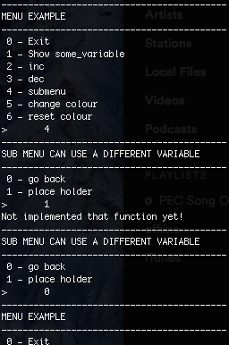

# Menu-System
A simple menu system in C which can be imported into any project.

## Features
* Provides function to change the output text foreground colour.
* Doesn't use `ncurses`.
* Allows for submenus to be created in the same way as a normal menu.
* Puts the terminal back to default settings after use.
* Quick and Easy to implement
* Provides a placeholder function for when you what to make a skeleton program. 
* Provides a quit function.



## Usage 
### Step 1
Set up the things you want in your menu by option name and the callback to it's function. __NB: This must contain the `menu_quit` option!__
```c
struct menu_options menu[] = {
                {"Exit",                          menu_quit 			},
		{"Show some_variable",	          show_var 			},
		{"inc",                           increment 			}, 
		{"dec",                           decrement  			},
		{"submenu",                       some_other_sub_menu           },
		{"change colour",                 colour_change      	        }, 
		{"reset colour",                  colour_reset  		},
		{"clear screen",                  menu_cls			}
	};
```

### Step 2
Call the `menu_loop` function, passing it the array created in Step 1, the prompt for the menu, and the address of anything that you want to pass to call backs. This can be an int or a struct or whatever you want.

```c
int some_variable = 0;
menu_loop(menu, menu_length(menu), "MENU EXAMPLE", &some_variable);
```

### Done. 

